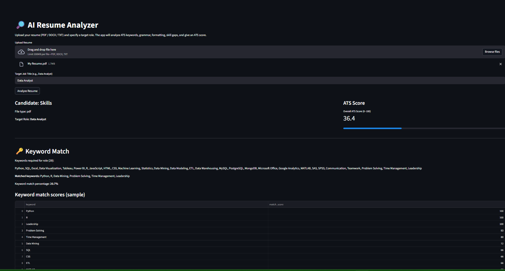

#🧠 AI Resume Analyzer (Groq API)

#🚀 Overview

AI Resume Analyzer is a Streamlit-based web app powered by the Groq API.
It allows users to upload their resume (PDF or DOCX) and get a detailed analysis comparing it to a given job description — highlighting:

✅ Strengths and matching keywords

⚠️ Weaknesses and missing skills

💡 Suggestions for improvement#

📊 Keyword relevance score

#🎯 Demo Screenshot

#🧩 Features

📄 Resume Upload: Supports PDF and DOCX formats

🧠 AI-Powered Evaluation: Uses Groq’s LLaMA-3.3 model for accurate HR-style analysis

🔍 Job Matching Insights: Highlights strengths, weaknesses, and missing keywords

🧾 Keyword Relevance Scoring: Helps you optimize your resume for ATS (Applicant Tracking Systems)

⚙️ Local + Secure: Uses .env file to store your API key safely

#🧰 Tech Stack
Component	Technology
Frontend	Streamlit
Backend	Python
AI Model	Groq LLaMA 3.3 70B
File Handling	PyPDF2, python-docx
Similarity Check	RapidFuzz
Environment	dotenv
3⚙️ Installation
1️⃣ Clone the Repository
git clone https://github.com/YOUR_USERNAME/resume-analyzer.git
cd resume-analyzer

2️⃣ Create a Virtual Environment
python -m venv venv
venv\Scripts\activate   # (Windows)
# or
source venv/bin/activate  # (Mac/Linux)

3️⃣ Install Dependencies
pip install -r requirements.txt

4️⃣ Add Your .env File

Create a file named .env in the root directory and add:

GROQ_API_KEY=shivam8595

5️⃣ Run the App
streamlit run app.py

Then open the link shown in your terminal (usually http://localhost:8501).

#📂 Project Structure
resume-analyzer/
│
├── app.py                # Main Streamlit App
├── requirements.txt      # Dependencies
├── .env                  # Your Groq API key
├── .gitignore            # To prevent key leaks
└── README.md             # This file

#🧾 Sample Output
✅ Resume Score: 82%
✅ Strong Match for: Python, Machine Learning, Flask
⚠️ Missing Keywords: REST API, Leadership
💡 Suggestion: Add measurable impact metrics to projects.

🛡️ Security Notes

Do not push .env file to GitHub.

Your Groq API key must remain private.

.gitignore already ensures .env is excluded.

🌍 Deploying on Streamlit Cloud

You can deploy this app directly on Streamlit Cloud
:

Push your code to GitHub.

Go to Streamlit Cloud and log in.

Click “New App” → Connect to GitHub Repo.

Add GROQ_API_KEY in Secrets section.

#Deploy 🚀

🤝 Contributing

Pull requests are welcome!
If you’d like to add features (like resume scoring charts or multiple JD comparison), feel free to fork the repo and submit PRs.

#📜 License

This project is licensed under the MIT License — feel free to modify and use it.

💬 Connect with Me

👤 Shivam (Developer)
📧 Email: [mauryashivam609@gmail.com]
💼 LinkedIn: [www.linkedin.com/in/shivammaurya01]
🌐 GitHub: Shivam-dev30

💡 “Your resume is your first impression — make it data-driven.”
